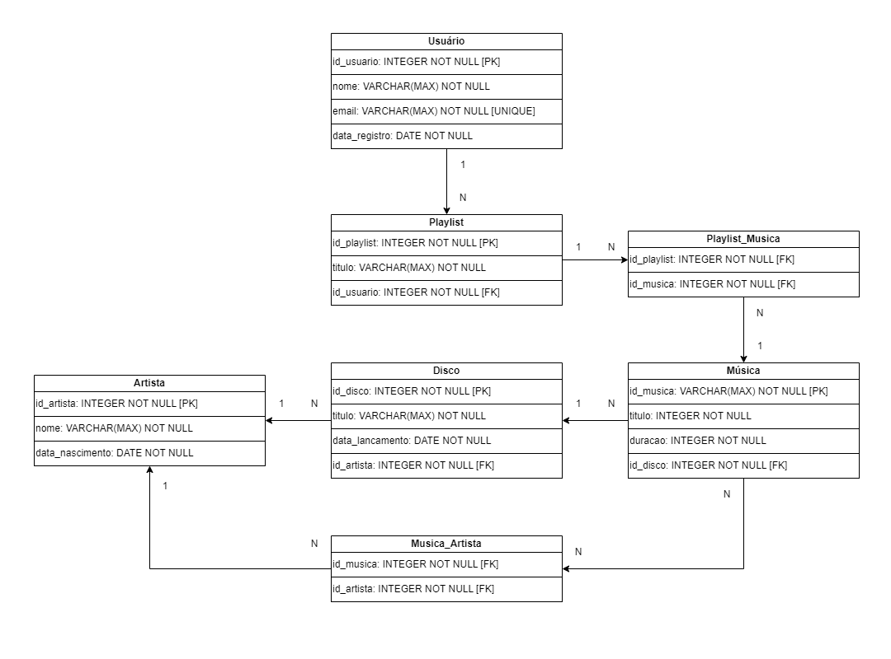

# Projeto 1 - Banco de dados
#### Alunos:
Guilherme Ferreira de Souza: `22.122.061-9`
Tainá Cunha Bueno: `22.119.025-9`

## Como Executar
Os códigos de cada solicitação feita foram escritos em um único arquivo. Para executá-lo, selecione o bloco desejado e execute separadamente. Evitando que todo código seja executado de uma vez.

## Diagrama Relacional

## Observação
Adicionamos duas tabelas intermediárias de relacionamento "muitos-para-muitos", sendo elas a tabela `Playlist_Musica` (`Playlist` e `Musica`) e `Musica_Artista` (`Musica` e `Artista`)

#### Nós Agradecemos!